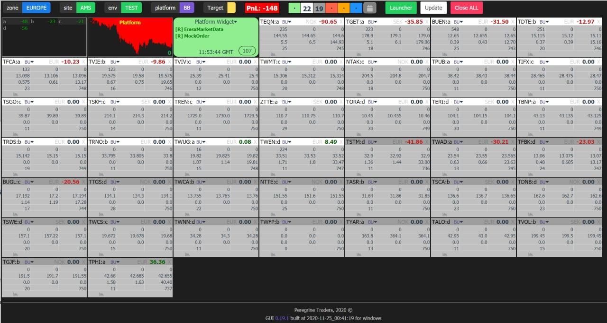
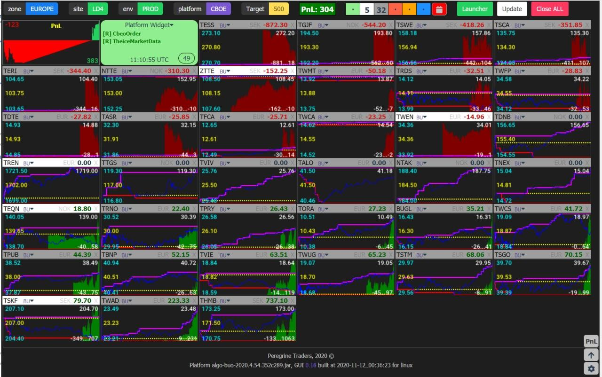
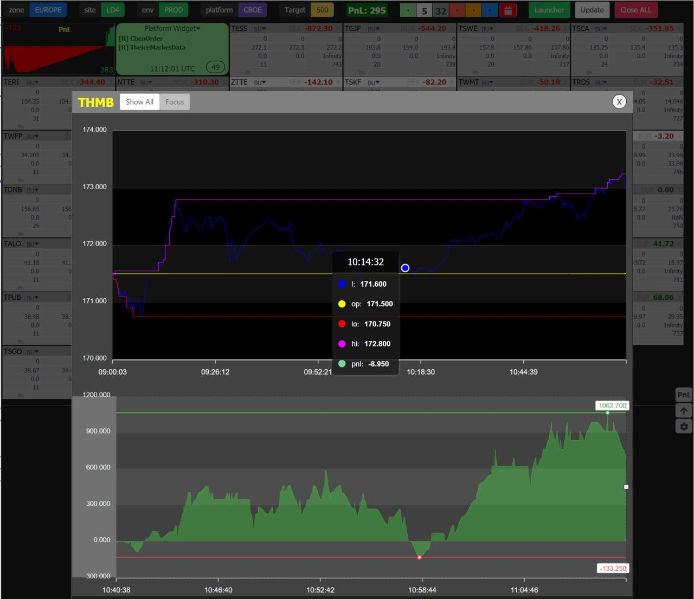

[](https://opensource.org/licenses/MIT)

# Synopsis

Trading algorithms dashboard application

This software is provided by [Peregrine Traders B.V.](https://www.peregrinetraders.com) under MIT license.

The application is build for traders and allows to control the state of the trading platform and all working algorithms in a single window.
The application has the same functionality on both desktop and mobile web browsers, this allows the application to be used for remote access.





### Features

- Launch algo instances
- Stop instance
- Stop all instances
- Display instance statuses by different colors
- Display figures related to instance:
- Display charts per instance of values: pnl, low price, high price, last price, open price.
- Display figures related to risk management
- Collapse/Expand mode
- Display pnl and pnl chart for each instance group.
- Sort instance matrix by id, pnl and status.
- Download instance execution log
- Display instance orders and executions
- Display all instance execution parameters.
- Display market holidays

## Motivation

## Design

The system consists of the following components:

- backend service providing REST API
- Redis
- SPA web application\*

> if necessary, the backend service can act as a web server and serve HTML/CSS/JS files at the request of the browser.

Redis is used for communication between trading servers and the application.

## Usage

```
$ adash help
$ adash help start
$ adash start --redis localhost:6379 --l :8081 -ff ./frontend -mh ./market_holidays.csv
```

Parameters:

- **redis** ip:port (default values is redis:6379. It's expected that domain redis is specified in /etc/hosts or windows/system32/drivers/etc/hosts);
- **l** http listening ip:port (default :8080, that means port 8080 on all IP addresses);
- **ff** path to frontend files;
- **mh** file with the list of market holidays.
- **d** debug mode

## Build

### Prerequisites

- Go >1.13
- Node.js
- npm
- Redis

```
go get PeregrineTradersDevTeam/algo-dashboard
cd ${GOPATH}/src/github.com/PeregrineTradersDevTeam/algo-dashboard/cmd

export ADASH_RELEASE=0.24 &&
cd ${GOPATH}/src/github.com/PeregrineTradersDevTeam/algo-dashboard/frontend/adash &&
npm run build &&
cd ${GOPATH}/src/github.com/PeregrineTradersDevTeam/algo-dashboard/cmd &&
go build -ldflags "-X main.ReleaseNumber=${ADASH_RELEASE} -X main.BuildTime=$( date '+%F_%H:%M:%S' )" &&
export GOOS=windows &&
go build -ldflags "-X main.ReleaseNumber=${ADASH_RELEASE} -X main.BuildTime=$( date '+%F_%H:%M:%S' )" -v
export GOOS=linux

```

## TODO

- Use websokets and push mode instead of the REST API
- Optimize generation of small .png chart in terms of traffic.

## License

This software is provided under MIT license.
